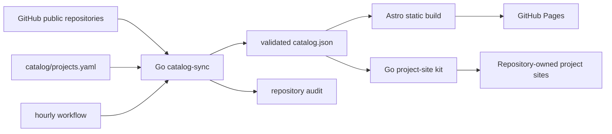

# rekurt portfolio hub

[Русский](README.ru.md) · [简体中文](README.zh-CN.md)

The source of [rekurt.github.io](https://rekurt.github.io): a multilingual portfolio, curated product catalog, complete public-repository registry, and shared static-site kit for the `rekurt` GitHub account.

The site separates original work, support repositories, maintained forks, and simple mirrors. It never treats an upstream fork homepage as the author's website. Version, release, repository, and README data are synchronized from GitHub; presentation and product grouping live in one reviewed YAML manifest.

## Architecture



- `cmd/catalog-sync` discovers public repositories and coordinates synchronization.
- `internal/githubapi` loads repository, release, tag, branch, manifest, and README metadata with retries, ETags, and response limits.
- `internal/markdown` rewrites relative links to commit-pinned GitHub URLs and sanitizes repository documentation.
- `catalog/projects.yaml` is the only curated source for product membership, summaries, installation commands, and maintained-fork attribution.
- `cmd/project-site` builds or safely decorates repository-owned static sites from the same catalog.
- `site/` statically generates English routes, Russian equivalents under `/ru/`, and Simplified Chinese equivalents under `/zh-cn/`.

No GitHub token, API call, database, analytics script, or cookie is needed at runtime.

## Local development

Prerequisites: Go 1.27, Node.js 24.20, npm 11, and optionally GitHub CLI for an authenticated live sync.

```bash
cd site && npm ci && cd ..
make check
make test
make build
cd site && npm run check:links
```

Start the development server:

```bash
cd site
npm run dev
```

Run a live synchronization without printing the token:

```bash
GITHUB_TOKEN="$(gh auth token)" go run ./cmd/catalog-sync sync \
  --manifest catalog/projects.yaml \
  --snapshot site/src/data/generated/catalog.json \
  --audit docs/repository-audit.md
```

## Add a product

1. Add one complete entry to `catalog/projects.yaml` with a stable slug, primary and support repositories, kind, domain, validated accent, English, Russian and Simplified Chinese summaries, and real installation commands.
2. Add `maintained_fork: true` and `upstream` when the product is based on a fork. Ordinary mirrors stay in the registry without a product entry.
3. Run the live synchronization and the full local checks.
4. Commit the manifest and generated files together with a Conventional Commit message.

Every new public repository appears in `/registry/` automatically after the hourly workflow. Promotion into the curated product catalog always requires review of the YAML entry.

## Publish a project site

For a project without an existing website, add this thin caller to `.github/workflows/pages.yml` in its repository:

```yaml
name: Pages
on:
  push:
    branches: [master]
  workflow_dispatch:
  schedule:
    - cron: "17 */6 * * *"
permissions:
  contents: read
  pages: write
  id-token: write
jobs:
  pages:
    uses: rekurt/rekurt.github.io/.github/workflows/project-pages.yml@main
    with:
      slug: project-slug
```

The workflow reads the latest repository documentation, refreshes public version metadata, builds all three locales, validates the artifact, and deploys it through GitHub Pages. Existing applications use the same commands after their own build:

```bash
go run ./cmd/project-site decorate --slug project-slug --snapshot site/src/data/generated/catalog.json --repo ../project --out ../_site --base-url https://rekurt.github.io/project/
go run ./cmd/project-site validate --slug project-slug --snapshot site/src/data/generated/catalog.json --repo ../project --out ../_site --base-url https://rekurt.github.io/project/
```

Verify the complete production family without following redirects:

```bash
make site-fleet-check
```

The checker reads only catalog-owned Pages URLs and requires the deployed build manifest, canonical metadata, JSON-LD, locale routes, sitemap, safe loaded resources, the author hub, and every sibling project link.

## Generated files

Do not edit these by hand:

- `site/src/data/generated/catalog.json`
- `docs/repository-audit.md`

The sync job runs at minute 17 of every hour and commits only material changes. Snapshot timestamps remain stable when the public data is unchanged, avoiding empty hourly commits.

## Recovery

- If GitHub is unavailable or rate-limited, rerun the `Sync catalog` workflow. The previous validated snapshot remains publishable.
- If validation fails, correct `catalog/projects.yaml` or the upstream metadata; never publish a partial snapshot.
- If Pages fails, rerun `Deploy Pages` after CI is green. The deployment artifact contains only `site/dist`.
- If an external website disappears, update the explicit manifest link or its repository Pages configuration, synchronize again, and verify the audit.

Contributions follow [CONTRIBUTING.md](CONTRIBUTING.md). Releases are prepared automatically from Conventional Commits by Release Please.
