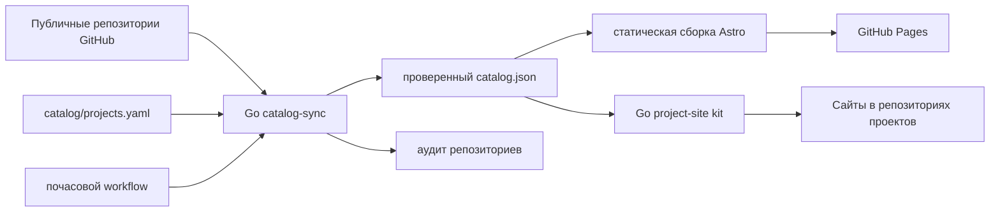

# Портфолио-хаб rekurt

[English](README.md) · [简体中文](README.zh-CN.md)

Исходный код [rekurt.github.io](https://rekurt.github.io): многоязычного портфолио, кураторского каталога продуктов, полного реестра публичных репозиториев и общего набора для статических сайтов аккаунта `rekurt`.

Сайт разделяет оригинальные работы, служебные репозитории, поддерживаемые форки и простые зеркала. Homepage исходного форка не считается авторским сайтом. Версии, релизы, репозитории и README синхронизируются с GitHub, а презентация и продуктовая группировка управляются одним проверяемым YAML-манифестом.

## Архитектура



- `cmd/catalog-sync` обнаруживает публичные репозитории и координирует синхронизацию.
- `internal/githubapi` загружает данные репозиториев, релизов, тегов, веток, манифестов и README с retry, ETag и лимитами ответа.
- `internal/markdown` переводит относительные ссылки в закреплённые за коммитом URL GitHub и очищает документацию.
- `catalog/projects.yaml` — единственный кураторский источник состава продуктов, описаний, команд установки и атрибуции форков.
- `cmd/project-site` создаёт новые или безопасно дополняет существующие статические сайты из общего каталога.
- `site/` создаёт английские маршруты, русские варианты под `/ru/` и китайские под `/zh-cn/`.

В runtime не нужны GitHub token, API, база данных, аналитика или cookies.

## Локальная разработка

Нужны Go 1.27, Node.js 24.20, npm 11 и, для авторизованной синхронизации, GitHub CLI.

```bash
cd site && npm ci && cd ..
make check
make test
make build
cd site && npm run check:links
```

Запуск dev-сервера:

```bash
cd site
npm run dev
```

Живая синхронизация без вывода токена:

```bash
GITHUB_TOKEN="$(gh auth token)" go run ./cmd/catalog-sync sync \
  --manifest catalog/projects.yaml \
  --snapshot site/src/data/generated/catalog.json \
  --audit docs/repository-audit.md
```

## Добавление продукта

1. Добавьте полную запись в `catalog/projects.yaml`: стабильный slug, основной и служебные репозитории, тип, домен, проверяемый accent, английское, русское и китайское описание, реальные команды установки.
2. Для продукта на основе форка задайте `maintained_fork: true` и `upstream`. Обычные зеркала остаются только в реестре.
3. Выполните живую синхронизацию и все локальные проверки.
4. Зафиксируйте манифест и сгенерированные файлы одним Conventional Commit.

Новый публичный репозиторий автоматически появляется в `/registry/` после почасового workflow. Включение в продуктовый каталог всегда требует review YAML-записи.

## Публикация сайта проекта

Для проекта без сайта добавьте в его `.github/workflows/pages.yml` тонкий вызов общего workflow:

```yaml
name: Pages
on:
  push:
    branches: [master]
  workflow_dispatch:
  schedule:
    - cron: "17 */6 * * *"
permissions:
  contents: read
  pages: write
  id-token: write
jobs:
  pages:
    uses: rekurt/rekurt.github.io/.github/workflows/project-pages.yml@main
    with:
      slug: project-slug
```

Workflow обновляет публичные версии, читает актуальную документацию репозитория, собирает три локали, проверяет артефакт и публикует его через GitHub Pages. Существующие приложения после своей сборки используют команды `project-site decorate` и `project-site validate` с теми же slug, snapshot, каталогом репозитория, каталогом артефакта и HTTPS base URL.

## Сгенерированные файлы

Не редактируйте вручную `site/src/data/generated/catalog.json` и `docs/repository-audit.md`. Workflow запускается в 17 минут каждого часа и создаёт commit только при содержательных изменениях.

## Восстановление

- При недоступности GitHub или rate limit повторите workflow `Sync catalog`: прежний проверенный snapshot остаётся пригодным к публикации.
- При ошибке валидации исправьте манифест или upstream-метаданные; частичный snapshot публиковать нельзя.
- При сбое Pages повторите `Deploy Pages` после зелёного CI.
- При исчезновении внешнего сайта исправьте явную ссылку или Pages-конфигурацию репозитория, повторите sync и проверьте аудит.

Правила изменений находятся в [CONTRIBUTING.md](CONTRIBUTING.md). Release Please формирует релизы из Conventional Commits.
