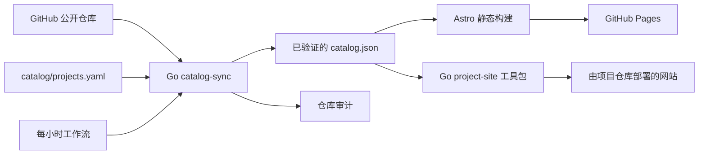

# rekurt 作品集中心

[English](README.md) · [Русский](README.ru.md)

这是 [rekurt.github.io](https://rekurt.github.io) 的源代码：包含多语言作品集、精选产品目录、`rekurt` GitHub 账号全部公开仓库的注册表，以及共享静态网站工具包。

网站会明确区分原创项目、支持仓库、持续维护的 fork 和普通镜像，不会把上游 fork 的主页当作作者的网站。版本、发布、仓库和 README 数据从 GitHub 同步；产品分组与展示内容由一个经过验证的 YAML 清单管理。

## 架构



- `cmd/catalog-sync` 发现公开仓库并执行同步。
- `internal/githubapi` 读取仓库、发布、标签、分支、清单和 README 数据，并实现重试、ETag 与响应大小限制。
- `internal/markdown` 将相对链接改写为固定提交的 GitHub URL，并清理仓库文档中的不安全 HTML。
- `catalog/projects.yaml` 是产品成员、摘要、安装命令和维护型 fork 归属信息的唯一人工数据源。
- `cmd/project-site` 使用同一目录生成新网站，或安全地增强现有静态网站。
- `site/` 生成默认英文页面、`/ru/` 俄文页面和 `/zh-cn/` 简体中文页面。

运行时不需要 GitHub token、API、数据库、分析脚本或 Cookie。

## 本地开发

需要 Go 1.27、Node.js 24.20、npm 11；执行认证同步时还需要 GitHub CLI。

```bash
cd site && npm ci && cd ..
make check
make test
make build
cd site && npm run check:links
```

开发服务器：

```bash
cd site
npm run dev
```

不输出 token 的实时同步：

```bash
GITHUB_TOKEN="$(gh auth token)" go run ./cmd/catalog-sync sync \
  --manifest catalog/projects.yaml \
  --snapshot site/src/data/generated/catalog.json \
  --audit docs/repository-audit.md
```

## 添加产品

1. 在 `catalog/projects.yaml` 添加完整条目：稳定 slug、主仓库与支持仓库、类型、领域、经过验证的 accent、英文、俄文与简体中文摘要，以及真实安装命令。
2. 基于 fork 的产品必须设置 `maintained_fork: true` 和 `upstream`。普通镜像只保留在完整注册表中。
3. 执行实时同步和全部本地检查。
4. 使用 Conventional Commit 将清单与生成文件一起提交。

新的公开仓库会在每小时工作流之后自动出现在 `/registry/`。加入精选产品目录始终需要审核 YAML 条目。

## 发布项目网站

没有现有网站的项目只需在自身 `.github/workflows/pages.yml` 中调用共享 workflow：

```yaml
name: Pages
on:
  push:
    branches: [master]
  workflow_dispatch:
  schedule:
    - cron: "17 */6 * * *"
permissions:
  contents: read
  pages: write
  id-token: write
jobs:
  pages:
    uses: rekurt/rekurt.github.io/.github/workflows/project-pages.yml@main
    with:
      slug: project-slug
```

该流程读取最新仓库文档、刷新公开版本元数据、构建三种语言、验证产物并通过 GitHub Pages 部署。现有应用在自己的构建之后，以同样的 slug、catalog snapshot、仓库目录、产物目录和 HTTPS base URL 运行 `project-site decorate` 与 `project-site validate`。

## 生成文件与恢复

不要手动编辑 `site/src/data/generated/catalog.json` 或 `docs/repository-audit.md`。同步工作流在每小时第 17 分钟运行，只有公开数据发生实质变化时才提交。

- GitHub 不可用或达到速率限制时，重新运行 `Sync catalog`；上一个已验证快照仍可发布。
- 验证失败时，修正清单或上游元数据，禁止发布部分快照。
- Pages 失败时，在 CI 通过后重新运行 `Deploy Pages`。
- 外部网站失效时，修正清单链接或对应仓库的 Pages 配置，再同步并检查审计报告。

修改规则见 [CONTRIBUTING.md](CONTRIBUTING.md)。Release Please 根据 Conventional Commits 自动准备版本。
